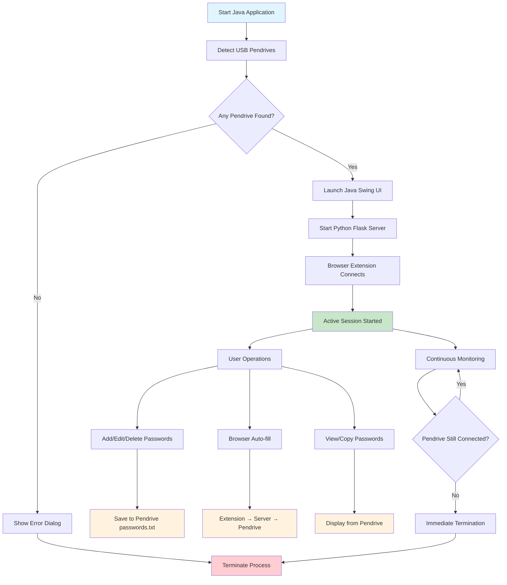

# 🔐 Hackathon Project – Pendrive-Based Password Manager

A **Hackathon Project** designed to provide **responsible and portable password security**.  
This system ensures that user credentials are only accessible when a **registered pendrive** is connected.  
If the pendrive is removed, all access to sensitive data is instantly revoked.  

---

## 🌟 Key Features
- **Pendrive-First Security** → Passwords are only available when the pendrive is connected.  
- **Real-Time Protection** → Continuous monitoring (2-second intervals) ensures immediate termination if pendrive is removed.  
- **Portable & Secure** → Carry your passwords safely in a hardware key with Base64 encryption.  
- **Browser Integration** → Chrome extension with auto-fill, context menu, and popup interface.  
- **Multi-Platform Detection** → Uses WMIC, FileSystemView, and direct enumeration for robust pendrive detection.  
- **Modern UI** → Java Swing interface with gradient design, password strength indicator, and keyboard shortcuts.  
- **REST API** → Python Flask server provides seamless communication between Java app and browser extension.  

---

## 📌 Workflow

1. **Pendrive Detection**  
   - Java application starts and detects USB pendrives using multiple methods (WMIC, FileSystemView, direct enumeration).  
   - If **no pendrive found → show error dialog and terminate**.  
   - If **pendrive found → continue to next step**.

2. **Application Launch**  
   - Java Swing UI launches automatically (no separate login screen).  
   - Python Flask server starts in background on localhost:5000.  
   - Browser extension connects to the local server.

3. **Password Management**  
   - User can add, edit, delete passwords through the Java UI.  
   - All passwords are stored encrypted (Base64) in `passwords.txt` on the pendrive.  
   - Real-time pendrive monitoring ensures data security.

4. **Browser Integration**  
   - Browser extension communicates with Python server via REST API.  
   - Auto-fill functionality works on any website.  
   - Context menu and popup interface for password access.

5. **Active Session & Security**  
   - Passwords remain accessible **only while pendrive is connected**.  
   - Continuous monitoring (every 2 seconds) checks pendrive status.  
   - If pendrive removed → application terminates immediately for security.

---

## ⚡ Flowchart



---

## 🏗️ Technical Architecture

### Components
- **Java Application** (`Main.java`, `PasswordManagerUI.java`, `PendriveDetector.java`)
  - Swing-based desktop application
  - Multi-method pendrive detection (WMIC, FileSystemView, direct enumeration)
  - Real-time pendrive monitoring with 2-second intervals
  - Base64 encryption for password storage

- **Python Flask Server** (`password_server.py`)
  - REST API server running on localhost:5000
  - CORS-enabled for browser extension communication
  - Endpoints: `/api/status`, `/api/passwords`, `/api/save`, `/api/search`

- **Chrome Browser Extension** (`manifest.json`, `background.js`, `popup.js`, `content.js`)
  - Manifest V3 extension
  - Context menu integration
  - Auto-fill functionality with smart field detection
  - Real-time server status monitoring

### Data Flow
1. **Storage**: Passwords stored as Base64-encoded strings in `passwords.txt` on pendrive
2. **Communication**: Browser extension ↔ Python server ↔ Pendrive storage
3. **Security**: Continuous pendrive monitoring with immediate termination on removal

### File Structure
```
Password manager/
├── src/main/java/com/codex/passwordmanager/
│   ├── Main.java                 # Application entry point
│   ├── PasswordManagerUI.java    # Swing UI implementation
│   └── PendriveDetector.java     # USB detection logic
├── password_server.py            # Flask REST API server
├── browser_extension/            # Chrome extension files
│   ├── manifest.json
│   ├── background.js
│   ├── popup.js
│   └── content.js
└── passwords.txt                 # Encrypted password storage (on pendrive)
```
